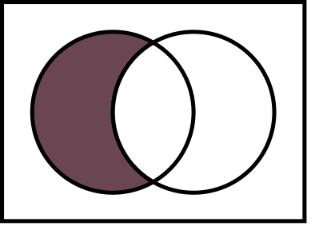

# Browserslist [![Cult Of Martians][cult-img]][cult]


The config to share target browsers and Node.js versions between different
front-end tools. It is used in:

* [Autoprefixer]
* [Babel]
* [postcss-preset-env]
* [eslint-plugin-compat]
* [stylelint-no-unsupported-browser-features]
* [postcss-normalize]
* [obsolete-webpack-plugin]

All tools will find target browsers automatically,
when you add the following to `package.json`:

```json
  "browserslist": [
    "defaults and fully supports es6-module",
    "maintained node versions"
  ]
```

Or in `.browserslistrc` config:

```yaml
# Browsers that we support

defaults and fully supports es6-module
maintained node versions
```

Developers set their version lists using queries like `last 2 versions`
to be free from updating versions manually.
Browserslist will use [`caniuse-lite`] with [Can I Use] data for this queries.

You can check how config works at our playground: [`browsersl.ist`](https://browsersl.ist/)

<a href="https://browsersl.ist/">
  
</a>

<br>
<br>
<div align="center">
  <a href="https://evilmartians.com/?utm_source=browserslist"></a>  <a href="https://cube.dev/?ref=eco-browserslist-github"></a>
</div>

[stylelint-no-unsupported-browser-features]: https://github.com/ismay/stylelint-no-unsupported-browser-features
[obsolete-webpack-plugin]:                   https://github.com/ElemeFE/obsolete-webpack-plugin
[eslint-plugin-compat]:                      https://github.com/amilajack/eslint-plugin-compat
[Browserslist Example]:                      https://github.com/browserslist/browserslist-example
[postcss-preset-env]:                        https://github.com/csstools/postcss-plugins/tree/main/plugin-packs/postcss-preset-env
[postcss-normalize]:                         https://github.com/csstools/postcss-normalize
[`browsersl.ist`]:                           https://browsersl.ist/
[`caniuse-lite`]:                            https://github.com/ben-eb/caniuse-lite
[Autoprefixer]:                              https://github.com/postcss/autoprefixer
[Can I Use]:                                 https://caniuse.com/
[Babel]:                                     https://github.com/babel/babel/tree/master/packages/babel-preset-env
[cult-img]: https://cultofmartians.com/assets/badges/badge.svg
[cult]: https://cultofmartians.com/done.html

## Table of Contents

* [Tools](#tools)
* [Best Practices](#best-practices)
* [Queries](#queries)
* [Config File](#config-file)
* [Shareable Configs](#shareable-configs)
* [Configuring for Different Environments](#configuring-for-different-environments)
* [Custom Usage Data](#custom-usage-data)
* [JS API](#js-api)
* [Environment Variables](#environment-variables)
* [Cache](#cache)
* [Security Contact](#security-contact)
* [For Enterprise](#for-enterprise)


## Sponsors

Browserslist needs your support. We are accepting donations
[at Open Collective](https://opencollective.com/browserslist).

<a href="https://www.springernature.com/"></a>      <a href="https://workleap.com/"></a>


## Tools

### Analyze your Browserslist Config

* Run `npx browserslist` in your project directory to see project’s
  target browsers. This CLI tool is built-in and available in any project
  with Autoprefixer.
* [`browserslist-lint`] checks your config for popular mistakes.


### Update `caniuse-lite`

* [`update-browserslist-db`] is a CLI tool to update browsers DB for queries
  like `last 2 version` or `>1%`.
* [`browserslist-update-action`] is a GitHub Action to automatically
  runs `update-browserslist-db` and proposes a pull request to merge updates.


### Show “We do not support your browser” Banner

* [`browserslist-useragent-regexp`] compiles Browserslist query to a RegExp
  to test browser useragent.
* [`browserslist-useragent-ruby`] is a Ruby library to checks browser
  by user agent string to match Browserslist.


### Get Statistics for `>5% in my stats`:

* [`browserslist-ga`] and [`browserslist-ga-export`] download your website
  browsers statistics to use it in `> 0.5% in my stats` query.
* [`browserslist-new-relic`] generate a custom usage data file for Browserslist
* [`browserslist-adobe-analytics`] use Adobe Analytics data to target browsers.
  from your New Relic Browser data.


### Others

* [`browserslist-rs`] is a Browserslist port to Rust.
* [`browserslist-browserstack`] runs BrowserStack tests for all browsers
  in Browserslist config.

[`browserslist-useragent-regexp`]: https://github.com/browserslist/browserslist-useragent-regexp
[`browserslist-adobe-analytics`]:  https://github.com/xeroxinteractive/browserslist-adobe-analytics
[`browserslist-useragent-ruby`]:   https://github.com/browserslist/browserslist-useragent-ruby
[`browserslist-update-action`]:    https://github.com/c2corg/browserslist-update-action
[`browserslist-browserstack`]:     https://github.com/xeroxinteractive/browserslist-browserstack
[`browserslist-ga-export`]:        https://github.com/browserslist/browserslist-ga-export
[`browserslist-useragent`]:        https://github.com/pastelsky/browserslist-useragent
[`update-browserslist-db`]:        https://github.com/browserslist/update-db
[`browserslist-new-relic`]:        https://github.com/syntactic-salt/browserslist-new-relic
[`browserslist-lint`]:             https://github.com/browserslist/lint/
[`browserslist-ga`]:               https://github.com/browserslist/browserslist-ga
[`browserslist-rs`]:               https://github.com/g-plane/browserslist-rs
[`caniuse-api`]:                   https://github.com/Nyalab/caniuse-api


### Text Editors

These extensions will add syntax highlighting for `.browserslistrc` files.

* [VS Code](https://marketplace.visualstudio.com/items?itemName=webben.browserslist)
* [Vim](https://github.com/browserslist/vim-browserslist)
* [WebStorm](https://plugins.jetbrains.com/plugin/16139-browserslist)

## Best Practices

* There is a `defaults` query, which gives a reasonable configuration
  for most users:

  ```json
    "browserslist": [
      "defaults"
    ]
  ```

* If you want to change the default set of browsers, we recommend including
  `last 2 versions, not dead, > 0.2%`. This is because `last n versions` on its
  own does not add popular old versions, while only using a percentage of usage
  numbers above `0.2%` will in the long run make popular browsers even more
  popular. We might run into a monopoly and stagnation situation, as we had with
  Internet Explorer 6. Please use this setting with caution.
* Select browsers directly (`last 2 Chrome versions`) only if you are making
  a web app for a kiosk with one browser. There are a lot of browsers
  on the market. If you are making general web app you should respect
  browsers diversity.
* Don’t remove browsers just because you don’t know them. Opera Mini has
  100 million users in Africa and it is more popular in the global market
  than Microsoft Edge. Chinese QQ Browsers has more market share than Firefox
  and desktop Safari combined.


## Queries

Browserslist will use browsers and Node.js versions query
from one of these sources:

1. `.browserslistrc` config file in current or parent directories.
2. `browserslist` key in `package.json` file in current or parent directories.
3. `browserslist` config file in current or parent directories.
4. `BROWSERSLIST` environment variable.
5. If the above methods did not produce a valid result
   Browserslist will use defaults:
   `> 0.5%, last 2 versions, Firefox ESR, not dead`.


### Query Composition

An `or` combiner can use the keyword `or` as well as `,`.
`last 1 version or > 1%` is equal to `last 1 version, > 1%`.

`and` query combinations are also supported to perform an
intersection of all the previous queries:
`last 1 version or chrome > 75 and > 1%` will select
(`browser last version` or `Chrome since 76`) and `more than 1% marketshare`.

There are 3 different ways to combine queries as depicted below. First you start
with a single query and then we combine the queries to get our final list.

Obviously you can *not* start with a `not` combiner, since there is no left-hand
side query to combine it with. The left-hand is always resolved as `and`
combiner even if `or` is used (this is an API implementation specificity).

| Query combiner type | Illustration | Example |
| ------------------- | :----------: | ------- |
|`or`/`,` combiner <br> (union) |   | `> .5% or last 2 versions` <br> `> .5%, last 2 versions` |
| `and` combiner <br> (intersection) |  | `> .5% and last 2 versions` |
| `not` combiner <br> (relative complement) |  | These three are equivalent to one another: <br> `> .5% and not last 2 versions` <br> `> .5% or not last 2 versions` <br> `> .5%, not last 2 versions` |

_A quick way to test your query is to do `npx browserslist '> 0.3%, not dead'`
in your terminal._

### Full List

You can specify the browser and Node.js versions by queries (case insensitive):

* `defaults`: Browserslist’s default browsers
  (`> 0.5%, last 2 versions, Firefox ESR, not dead`).
* By usage statistics:
  * `> 5%`: browsers versions selected by global usage statistics.
  `>=`, `<` and `<=` work too.
  * `> 5% in US`: uses USA usage statistics.
    It accepts [two-letter country code].
  * `> 5% in alt-AS`: uses Asia region usage statistics.
    List of all region codes can be found at [`caniuse-lite/data/regions`].
  * `> 5% in my stats`: uses [custom usage data].
  * `> 5% in browserslist-config-mycompany stats`: uses [custom usage data]
    from `browserslist-config-mycompany/browserslist-stats.json`.
  * `cover 99.5%`: most popular browsers that provide coverage.
  * `cover 99.5% in US`: same as above, with [two-letter country code].
  * `cover 99.5% in my stats`: uses [custom usage data].
* Last versions:
  * `last 2 versions`: the last 2 versions for *each* browser.
  * `last 2 Chrome versions`: the last 2 versions of Chrome browser.
  * `last 2 major versions` or `last 2 iOS major versions`:
    all minor/patch releases of last 2 major versions.
* `dead`: browsers without official support or updates for 24 months.
  Right now it is `IE 11`, `IE_Mob 11`, `BlackBerry 10`, `BlackBerry 7`,
  `Samsung 4`, `OperaMobile 12.1` and all versions of `Baidu`.
* Node.js versions:
  * `node 10` and `node 10.4`: selects latest Node.js `10.x.x`
  or `10.4.x` release.
  * `last 2 node versions`: select 2 latest Node.js releases.
  * `last 2 node major versions`: select 2 latest major-version Node.js releases.
  * `current node`: Node.js version used by Browserslist right now.
  * `maintained node versions`: all Node.js versions, which are [still maintained]
    by Node.js Foundation.
* Browsers versions:
  * `iOS 7`: the iOS browser version 7 directly. Note, that `op_mini`
    has special version `all`.
  * `Firefox > 20`: versions of Firefox newer than 20.
    `>=`, `<` and `<=` work too. It also works with Node.js.
  * `ie 6-8`: selects an inclusive range of versions.
  * `Firefox ESR`: the latest [Firefox Extended Support Release].
  * `PhantomJS 2.1` and `PhantomJS 1.9`: selects Safari versions similar
    to PhantomJS runtime.
* `extends browserslist-config-mycompany`: take queries from
  `browserslist-config-mycompany` npm package.
* By browser support:<br>
  In these example queries `es6` and `es6-module` are the the `feat` parameter
  from the URL of the [Can I Use] page. A list of all available features can be
  found at [`caniuse-lite/data/features`].
  * `fully supports es6`: browsers with full support for specific
    features. For example, `fully supports css-grid` will omit Edge 12-15, as
    those browser versions are marked as [having partial support].
  * `partially supports es6-module` or `supports es6-module`:  browsers with
    full or partial support for specific features. For example,
    `partially supports css-grid` will include Edge 12-15 support, as those
    browser versions are marked as [having partial support].
* `browserslist config`: the browsers defined in Browserslist config. Useful
  in Differential Serving to modify user’s config like
  `browserslist config and fully supports es6-module`.
* `since 2015` or `last 2 years`: all versions released since year 2015
  (also `since 2015-03` and `since 2015-03-10`).
* `unreleased versions` or `unreleased Chrome versions`:
  alpha and beta versions.
* `not ie <= 8`: exclude IE 8 and lower from previous queries.

You can add `not ` to any query.

[`caniuse-lite/data/regions`]: https://github.com/ben-eb/caniuse-lite/tree/main/data/regions
[`caniuse-lite/data/features`]: https://github.com/ben-eb/caniuse-lite/tree/main/data/features
[two-letter country code]:     https://en.wikipedia.org/wiki/ISO_3166-1_alpha-2#Officially_assigned_code_elements
[custom usage data]:           #custom-usage-data
[still maintained]:            https://github.com/nodejs/Release
[Can I Use]:                   https://caniuse.com/
[Firefox Extended Support Release]: https://support.mozilla.org/en-US/kb/choosing-firefox-update-channel
[having partial support]: https://caniuse.com/css-grid

### Grammar Definition

There is a [grammar specification](./grammar.w3c-ebnf) about the query syntax,
which may be helpful if you're implementing a parser or something else.

### Debug

Run `npx browserslist` in a project directory to see which browsers were selected
by your queries.

```sh
$ npx browserslist
and_chr 61
and_ff 56
and_qq 1.2
and_uc 11.4
android 56
baidu 7.12
bb 10
chrome 62
edge 16
firefox 56
ios_saf 11
opera 48
safari 11
samsung 5
```


### Browsers

The following table maps browser names & their target devices into identifiers used by browserslist.

| Browser Name             | Desktop         | Android                   | iOS                      | Other Mobile      |
| ------------------------ | --------------- | ------------------------- | ------------------------ | ----------------- |
| Android (WebView)        |                 | `Android`                 |                          |                   |
| Baidu                    | `Baidu`         |                           |                          |                   |
| BlackBerry               |                 |                           |                          | `BlackBerry` `bb` |
| Chrome                   | `Chrome`        | `ChromeAndroid` `and_chr` | ↪︎ `ios_saf`<sup>2</sup> |                   |
| Edge                     | `Edge`          | ↪︎ `and_chr`              | ↪︎ `ios_saf`<sup>2</sup> |                   |
| Electron                 | `Electron`      |                           |                          |                   |
| Firefox                  | `Firefox` `ff`  | `FirefoxAndroid` `and_ff` | ↪︎ `ios_saf`<sup>2</sup> |                   |
| Internet Explorer        | `Explorer` `ie` |                           |                          | `ie_mob`          |
| Node.js                  | `Node`          |                           |                          |                   |
| [KaiOS Browser]          |                 |                           |                          | `kaios`           |
| Opera                    | `Opera`         | `op_mob` <sup>1</sup>     | ↪︎ `ios_saf`<sup>2</sup> |                   |
| [Opera Mini]<sup>3</sup> |                 | `OperaMini` `op_mini`     |                          |                   |
| [QQ browser]             |                 | `and_qq`                  |                          |                   |
| Safari                   | `Safari`        |                           | `iOS` `ios_saf`          |                   |
| Samsung Internet         |                 | `Samsung`                 |                          |                   |
| [UC Browser]             |                 | `UCAndroid` `and_uc`      |                          |                   |

- `↪︎ name` implies that the browser uses the same engine captured by `name`
- <sup>1</sup> [Opera Mobile ≈ Chrome Android](https://github.com/Fyrd/caniuse/issues/5602#issuecomment-792385127)
- <sup>2</sup> [All iOS browsers use WebKit](https://en.wikipedia.org/wiki/WebKit)
- <sup>3</sup> Opera Mini has 2 modes “Extreme” and “High” for data saving.
  `op_mini` targets at the “Extreme” one.
  “High” is compatible with the normal Opera Mobile.

[KaiOS Browser]: https://medium.com/design-at-kai/what-you-didnt-know-about-kaios-browser-53937ea1636
[QQ browser]: https://en.wikipedia.org/wiki/QQ_browser
[Opera Mini]: https://en.wikipedia.org/wiki/Opera_Mini
[UC Browser]: https://en.wikipedia.org/wiki/UC_Browser

## Config File

### `package.json`

If you want to reduce config files in project root, you can specify
browsers in `package.json` with `browserslist` key:

```json
{
  "private": true,
  "dependencies": {
    "autoprefixer": "^6.5.4"
  },
  "browserslist": [
    "last 1 version",
    "> 1%",
    "not dead"
  ]
}
```


### `.browserslistrc`

Separated Browserslist config should be named `.browserslistrc`
and have browsers queries split by a new line.
Each line is combined with the `or` combiner. Comments starts with `#` symbol:

```yaml
# Browsers that we support

last 1 version
> 1%
not dead # no browsers without security updates
```

Browserslist will check config in every directory in `path`.
So, if tool process `app/styles/main.css`, you can put config to root,
`app/` or `app/styles`.

You can specify direct path in `BROWSERSLIST_CONFIG` environment variables.


## Shareable Configs

You can use the following query to reference an exported Browserslist config
from another package:

```json
  "browserslist": [
    "extends browserslist-config-mycompany"
  ]
```

For security reasons, external configuration only supports packages that have
the `browserslist-config-` prefix. npm scoped packages are also supported, by
naming or prefixing the module with `@scope/browserslist-config`, such as
`@scope/browserslist-config` or `@scope/browserslist-config-mycompany`.

If you don’t accept Browserslist queries from users, you can disable the
validation by using the or `BROWSERSLIST_DANGEROUS_EXTEND` environment variable.

```sh
BROWSERSLIST_DANGEROUS_EXTEND=1 npx webpack
```

Because this uses `npm`'s resolution, you can also reference specific files
in a package:

```json
  "browserslist": [
    "extends browserslist-config-mycompany/desktop",
    "extends browserslist-config-mycompany/mobile"
  ]
```

When writing a shared Browserslist package, just export an array.
`browserslist-config-mycompany/index.js`:

```js
module.exports = [
  'last 1 version',
  '> 1%',
  'not dead'
]
```

You can also include a `browserslist-stats.json` file as part of your shareable
config at the root and query it using
`> 5% in browserslist-config-mycompany stats`. It uses the same format
as `extends` and the `dangerousExtend` property as above.

You can export configs for different environments and select environment
by `BROWSERSLIST_ENV` or `env` option in your tool:

```js
module.exports = {
  development: [
    'last 1 version'
  ],
  production: [
    'last 1 version',
    '> 1%',
    'not dead'
  ]
}
```


## Configuring for Different Environments

You can also specify different browser queries for various environments.
Browserslist will choose query according to `BROWSERSLIST_ENV` or `NODE_ENV`
variables. If none of them is declared, Browserslist will firstly look
for `production` queries and then use defaults.

In `package.json`:

```js
  "browserslist": {
    "production": [
      "> 1%",
      "not dead"
    ],
    "modern": [
      "last 1 chrome version",
      "last 1 firefox version"
    ],
    "ssr": [
      "node 12"
    ]
  }
```

In `.browserslistrc` config:

```ini
[production]
> 1%
not dead

[modern]
last 1 chrome version
last 1 firefox version

[ssr]
node 12
```


## Custom Usage Data

If you have a website, you can query against the usage statistics of your site.
[`browserslist-ga`] will ask access to Google Analytics and then generate
`browserslist-stats.json`:

```
npx browserslist-ga
```

Or you can use [`browserslist-ga-export`] to convert Google Analytics data without giving a password for Google account.

You can generate usage statistics file by any other method. File format should
be like:

```js
{
  "ie": {
    "6": 0.01,
    "7": 0.4,
    "8": 1.5
  },
  "chrome": {
    …
  },
  …
}
```

Note that you can query against your custom usage data while also querying
against global or regional data. For example, the query
`> 1% in my stats, > 5% in US, 10%` is permitted.

[`browserslist-ga-export`]: https://github.com/browserslist/browserslist-ga-export
[`browserslist-ga`]:        https://github.com/browserslist/browserslist-ga
[Can I Use]:                https://caniuse.com/


## JS API

```js
const browserslist = require('browserslist')

// Your CSS/JS build tool code
function process (source, opts) {
  const browsers = browserslist(opts.overrideBrowserslist, {
    stats: opts.stats,
    path:  opts.file,
    env:   opts.env
  })
  // Your code to add features for selected browsers
}
```

Queries can be a string `"> 1%, not dead"`
or an array `['> 1%', 'not dead']`.

If a query is missing, Browserslist will look for a config file.
You can provide a `path` option (that can be a file) to find the config file
relatively to it.

Options:

* `path`: file or a directory path to look for config file. Default is `.`.
* `env`: what environment section use from config. Default is `production`.
* `stats`: custom usage statistics data.
* `config`: path to config if you want to set it manually.
* `ignoreUnknownVersions`: do not throw on direct query (like `ie 12`).
  Default is `false`.
* `dangerousExtend`: Disable security checks for `extend` query.
  Default is `false`.
* `throwOnMissing`: throw an error if env is not found.
  Default is `false`.
* `mobileToDesktop`: Use desktop browsers if Can I Use doesn’t have data
  about this mobile version. Can I Use has only data about
  latest versions of mobile browsers. By default, `last 2 and_ff versions`
  returns `and_ff 90` and with this option it returns `and_ff 91, and_ff 90`.
  This option may lead to unknown browser version error (in example Can I Use
  doesn’t have data for `and_ff 91` yet). Default is `false`.

For non-JS environment and debug purpose you can use CLI tool:

```sh
browserslist "> 1%, not dead"
```

You can get total users coverage for selected browsers by JS API:

```js
browserslist.coverage(browserslist('> 1%'))
//=> 81.4
```

```js
browserslist.coverage(browserslist('> 1% in US'), 'US')
//=> 83.1
```

```js
browserslist.coverage(browserslist('> 1% in my stats'), 'my stats')
//=> 83.1
```

```js
browserslist.coverage(browserslist('> 1% in my stats', { stats }), stats)
//=> 82.2
```

Or by CLI:

```sh
$ browserslist --coverage "> 1%"
These browsers account for 81.4% of all users globally
```

```sh
$ browserslist --coverage=US "> 1% in US"
These browsers account for 83.1% of all users in the US
```

```sh
$ browserslist --coverage "> 1% in my stats"
These browsers account for 83.1% of all users in custom statistics
```

```sh
$ browserslist --coverage "> 1% in my stats" --stats=./stats.json
These browsers account for 83.1% of all users in custom statistics
```


## Environment Variables

If a tool uses Browserslist inside, you can change the Browserslist settings
with [environment variables]:

* `BROWSERSLIST` with browsers queries.

   ```sh
  BROWSERSLIST="> 5%" npx webpack
   ```

* `BROWSERSLIST_CONFIG` with path to config file.

   ```sh
  BROWSERSLIST_CONFIG=./config/browserslist npx webpack
   ```

* `BROWSERSLIST_ENV` with environments string.

   ```sh
  BROWSERSLIST_ENV="development" npx webpack
   ```

* `BROWSERSLIST_STATS` with path to the custom usage data
  for `> 1% in my stats` query.

   ```sh
  BROWSERSLIST_STATS=./config/usage_data.json npx webpack
   ```

* `BROWSERSLIST_DISABLE_CACHE` if you want to disable config reading cache.

   ```sh
  BROWSERSLIST_DISABLE_CACHE=1 npx webpack
   ```

* `BROWSERSLIST_DANGEROUS_EXTEND` to disable security shareable config
  name check.

   ```sh
  BROWSERSLIST_DANGEROUS_EXTEND=1 npx webpack
   ```

* `BROWSERSLIST_ROOT_PATH` to prevent reading files above this path.

   ```sh
  BROWSERSLIST_ROOT_PATH=. npx webpack
   ```

[environment variables]: https://en.wikipedia.org/wiki/Environment_variable


## Cache

Browserslist caches the configuration it reads from `package.json` and
`browserslist` files, as well as knowledge about the existence of files,
for the duration of the hosting process.

To clear these caches, use:

```js
browserslist.clearCaches()
```

To disable the caching altogether, set the `BROWSERSLIST_DISABLE_CACHE`
environment variable.


## Security Contact

To report a security vulnerability, please use the [Tidelift security contact].
Tidelift will coordinate the fix and disclosure.

[Tidelift security contact]: https://tidelift.com/security


## For Enterprise

Available as part of the Tidelift Subscription.

The maintainers of `browserslist` and thousands of other packages are working
with Tidelift to deliver commercial support and maintenance for the open source
dependencies you use to build your applications. Save time, reduce risk,
and improve code health, while paying the maintainers of the exact dependencies
you use. [Learn more.](https://tidelift.com/subscription/pkg/npm-browserslist?utm_source=npm-browserslist&utm_medium=referral&utm_campaign=enterprise&utm_term=repo)


## Browsers Data Updating

See [`update-browserslist-db` docs](https://github.com/browserslist/update-db#readme)
